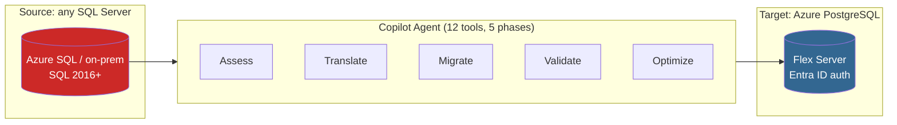
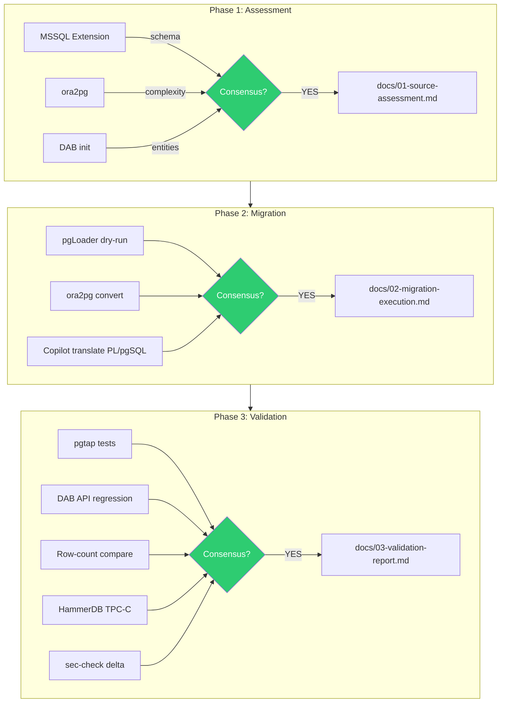

## <!--

page_type: sample
languages:

- sql
- tsql
- plpgsql
- bash
  products:
- azure
- azure-database-postgresql
- azure-sql-database
- github-copilot
- microsoft-fabric
- vs-code
  name: SQL Server to PostgreSQL Migration Accelerator
  description: Reusable, one-click migration accelerator from SQL Server to Azure Database for PostgreSQL Flexible Server, orchestrated by a Copilot agent with multi-tool cross-validation.
  urlFragment: sql-to-postgres-migration

---

-->

# SQL Server to PostgreSQL Migration Accelerator

[](https://codespaces.new/kfolkes/sql-to-postgres-migration?quickstart=1)
[](https://vscode.dev/redirect?url=vscode://ms-vscode-remote.remote-containers/cloneInVolume?url=https://github.com/kfolkes/sql-to-postgres-migration)
[](https://github.com/kfolkes/sql-to-postgres-migration/actions/workflows/smoke-test.yml)
[](LICENSE)

A **reusable, one-click** migration accelerator that moves SQL Server databases to Azure Database for PostgreSQL Flexible Server. Built for database teams. Orchestrated by a GitHub Copilot agent. Validated by 12 cross-checking tools.

> **Live demo:** open the badge above to launch a fully configured Codespace with SQL Server 2022 + PostgreSQL 16 + WideWorldImporters pre-loaded — then ask Copilot Chat: `/db-migrate`.



---

## Two ways to use it

| Mode                                                         | When to use                       | What you run                                                         |
| ------------------------------------------------------------ | --------------------------------- | -------------------------------------------------------------------- |
| **Demo** — WideWorldImporters local Docker                   | First time, workshops, live demos | `/db-migrate samples/wide-world-importers` (or just click the badge) |
| **BYO Endpoint** — your own SQL Server → your own PostgreSQL | Real customer migrations          | Edit [.env](.env.example) → `/db-migrate` (no argument)              |

Both modes use the **same agent, same skill, same validation gates** — only the connection strings change.

---

## Quickstart (5 minutes, zero local install)

1. Click **[Open in GitHub Codespaces](https://codespaces.new/kfolkes/sql-to-postgres-migration?quickstart=1)** above.
2. Wait ~3 minutes — the dev container installs `psql`, `sqlcmd`, starts SQL Server 2022 + PostgreSQL 16, and restores WideWorldImporters automatically.
3. Open Copilot Chat and run:
   ```
   /db-migrate samples/wide-world-importers
   ```
4. Watch the agent execute Phases 1–3 and produce result docs in [docs/](docs/).

That's the live-demo path. For real customer migrations, follow [Bring your own endpoint](#bring-your-own-endpoint) below.

---

## Local quickstart (Docker required)

Open a bash shell in the repo (Codespace, dev container, WSL, macOS, or Linux):

```bash
cp .env.example .env                   # defaults are safe for local demo
wsl zsh -c "scripts/setup-local-env.sh"        # starts containers + restores WideWorldImporters (~3 min first run)
wsl zsh -c "scripts/migrate-data.sh"           # schema + 31 tables + 6 functions + row-count validation
```

Successful output ends with:

```
[5/5] Validating row counts...
  Row count validation: 31 matched, 0 mismatched out of 31 tables
  Migration Complete!
```

| Service                 | Host        | Port | User       | Password                         | Database               |
| ----------------------- | ----------- | ---- | ---------- | -------------------------------- | ---------------------- |
| SQL Server 2022         | `localhost` | 1433 | `sa`       | see [.env.example](.env.example) | `WideWorldImporters`   |
| PostgreSQL 16 (PostGIS) | `localhost` | 5432 | `wwi_user` | see [.env.example](.env.example) | `wide_world_importers` |

```bash
docker compose down       # stop containers (data persists)
docker compose down -v    # full reset (deletes volumes)
```

---

## Bring your own endpoint

To migrate any customer SQL Server to any PostgreSQL — Azure Flex Server, AWS RDS, Cloud SQL, on-prem — set the connection variables in [.env](.env.example) and run a single script:

```bash
cp .env.example .env
# Edit .env:
#   SQLSERVER_HOST='mycorp-sql.database.windows.net'
#   SQLSERVER_DB='ProductionDb'
#   SQLSERVER_USER='migrate_user'
#   SQLSERVER_PASSWORD='...'
#   PG_HOST='mycorp-pg.postgres.database.azure.com'
#   PG_DB='production_db'
#   PG_USER='migrate_user'
#   PG_PASSWORD='...'

wsl zsh -c "scripts/migrate-endpoint.sh --dry-run"    # validate connectivity + type mappings
wsl zsh -c "scripts/migrate-endpoint.sh"              # perform migration via pgloader
```

The same Copilot agent works on the customer endpoint:

```
/db-migrate
```

(no argument → BYO mode → reads `.env`).

Required tools: `pgloader`, `psql`, `sqlcmd`. All three are pre-installed in the dev container.

---

## Architecture



Every critical step is validated by 2–3 independent tools — no single tool decides:

| Step             | Tool 1     | Tool 2             | Tool 3           |
| ---------------- | ---------- | ------------------ | ---------------- |
| Schema discovery | MSSQL ext  | ora2pg             | DAB              |
| SP translation   | Copilot    | ora2pg             | sqlfluff + pgtap |
| Data migration   | pgLoader   | DAB API regression | row counts       |
| Performance      | SSMS plans | HammerDB TPC-C     | pgbench          |
| Security         | sec-check  | Defender for DBs   | CodeQL           |

---

## What's in the box

```
sql-to-postgres-migration/
├── .devcontainer/                # One-click Codespaces / dev container
├── .github/
│   ├── agents/db-migration.agent.md       # The reusable migration agent
│   ├── prompts/db-migrate.prompt.md       # /db-migrate one-click prompt
│   ├── skills/sql-to-postgres/SKILL.md    # Single source of truth for orchestration
│   ├── workflows/                         # CI: smoke test + migration validation
│   └── ISSUE_TEMPLATE/                    # Bug / feature templates
├── scripts/
│   ├── setup-local-env.sh        # Demo: start containers + restore .bak
│   ├── migrate-data.sh           # Demo: WideWorldImporters → PostgreSQL
│   ├── migrate-endpoint.sh       # BYO: any SQL Server → any PostgreSQL (pgloader)
│   ├── run-assessment.sh         # Phase 1 helper
│   ├── run-migration.sh          # Phase 2 helper
│   └── validate-migration.sh     # Phase 3 helper
├── samples/wide-world-importers/ # Microsoft demo DB assets + pre-translated PL/pgSQL
├── dab/                          # Data API Builder configs (SQL, PG, Fabric)
├── tests/
│   ├── pgtap/                    # PL/pgSQL functional equivalence tests
│   ├── security/                 # 10 security tests (sec-001..010)
│   ├── performance/              # 10 perf tests (perf-001..010)
│   └── row-count-comparison/     # Source ↔ target row count validation
├── benchmarks/hammerdb/          # TPC-C scripts (both SQL and PG)
├── benchmarks/pgbench/           # pgbench load test
├── reference/
│   ├── tsql-to-plpgsql-cheatsheet.md
│   └── azure-architecture-center.md
├── docs/                         # Generated phase result docs
├── docker-compose.yml
├── .env.example                  # Two-mode env template (demo + BYO)
└── .gitattributes                # Enforces LF line endings (cross-platform)
```

---

## Optional CLI tools (for advanced workflows)

| Tool     | Install                                           | Purpose                                  |
| -------- | ------------------------------------------------- | ---------------------------------------- |
| .NET 8+  | <https://get.dot.net>                             | DAB CLI                                  |
| DAB CLI  | `dotnet tool install microsoft.dataapibuilder -g` | API layer + MCP                          |
| pgLoader | `apt install pgloader` / `brew install pgloader`  | BYO endpoint migrations                  |
| ora2pg   | <https://ora2pg.darold.net>                       | Independent assessment + auto-conversion |
| HammerDB | <https://hammerdb.com>                            | Cross-platform TPC-C benchmarking        |
| sqlfluff | `pip install sqlfluff`                            | PL/pgSQL linting                         |
| pgTAP    | `apt install pgtap`                               | PostgreSQL unit testing                  |
| SSMS 22  | <https://learn.microsoft.com/ssms>                | Source execution-plan baseline           |

All of these are **pre-installed in the dev container** so workshop attendees never have to set up tooling.

---

## Demo database: WideWorldImporters

Microsoft's official SQL Server sample database. Ideal for showing migration risk because it contains:

- **31 tables** across `Application`, `Purchasing`, `Sales`, `Warehouse`, `Website`
- **6 stored procedures** (translated to PL/pgSQL functions in [samples/wide-world-importers/migration-scripts/tsql-to-plpgsql/](samples/wide-world-importers/migration-scripts/tsql-to-plpgsql/))
- **Temporal tables** (system-versioned)
- **JSON columns**, **HIERARCHYID**, **GEOGRAPHY** types
- **~1.06 million rows** end-to-end
- Source backup: <https://aka.ms/WideWorldImporters>

Validated migration result (current `main`):

```
Tables created:    31
Data transferred:  31/31 tables
Functions:         6 PL/pgSQL functions
Row validation:    31/31 matched
```

---

## Roadmap / phases

| Phase                           | Status      | Output                                                           |
| ------------------------------- | ----------- | ---------------------------------------------------------------- |
| 1. Source assessment            | ✅ stable   | [docs/01-source-assessment.md](docs/01-source-assessment.md)     |
| 2. Migration execution          | ✅ stable   | [docs/02-migration-execution.md](docs/02-migration-execution.md) |
| 3. Validation & testing         | ✅ stable   | [docs/03-validation-report.md](docs/03-validation-report.md)     |
| 4. Microsoft Fabric integration | 🟡 optional | [docs/04-fabric-integration.md](docs/04-fabric-integration.md)   |
| 5. Data agent + GraphQL         | 🟡 optional | [docs/05-data-agent-setup.md](docs/05-data-agent-setup.md)       |

---

## Resources

- [Azure Database for PostgreSQL Flexible Server](https://learn.microsoft.com/azure/postgresql/flexible-server/)
- [Azure Database Migration guide: SQL Server → PostgreSQL](https://learn.microsoft.com/data-migration/sql-server/postgresql/)
- [pgLoader documentation](https://pgloader.io/)
- [ora2pg documentation](https://ora2pg.darold.net/)
- [Data API Builder](https://learn.microsoft.com/azure/data-api-builder/)
- [GitHub Copilot agents & skills](https://docs.github.com/copilot)

---

## Contributing & support

- See [CONTRIBUTING.md](CONTRIBUTING.md) for the dev workflow.
- Report bugs via [Issues](../../issues/new/choose).
- Security disclosures: please use [MSRC](https://msrc.microsoft.com/create-report) (see [SECURITY.md](SECURITY.md)).
- This project follows the [Microsoft Open Source Code of Conduct](CODE_OF_CONDUCT.md).

## Trademarks

This project may contain trademarks or logos for projects, products, or services. Authorized use of Microsoft trademarks or logos is subject to and must follow [Microsoft's Trademark & Brand Guidelines](https://www.microsoft.com/legal/intellectualproperty/trademarks/usage/general). Use of Microsoft trademarks or logos in modified versions of this project must not cause confusion or imply Microsoft sponsorship. Any use of third-party trademarks or logos is subject to those third parties' policies.

## License

[MIT](LICENSE)
